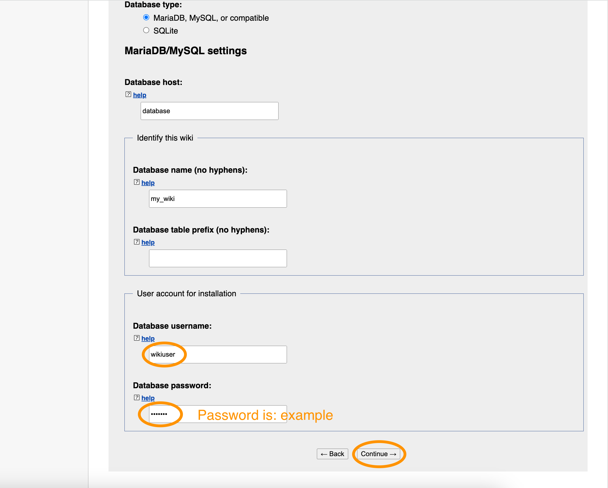

# Stats

Number of articles: 1036759
Folder size: 1.26GB

# Increase URI size limit of Apache server

1. Open `/etc/apache2/apache2.conf` and insert:

```
LimitRequestLine 4294967296
LimitRequestFieldSize 4294967296
```

Raise the URI byte size limit to 4 GiB.

2. Open `/etc/apache2/sites-available/000-default.conf` and insert the same two lines:

```
LimitRequestLine 4294967296
LimitRequestFieldSize 4294967296
```

Reference: https://stackoverflow.com/a/57246448/6798201

# Start MediaWiki Server
```
docker-compose up
```

# Setup MediaWiki
1. Open `localhost:8080` in your favorite browser. Click on `complete the installation` to continue.


2. You will see the installation welcome page.


Scroll down and press `continue`.


3. Set `Wiki language` to `zh - 中文` and press `continue`.


4. Set `Database host` to be `database` and scroll down.


Set `Database username` to be `wikiuser` and `Database password` to be `example`. Then press `continue`.



5. Press `continue`


6. Set the `Name of wiki` to be `my_wiki`. Set the `Your username` to be anything you like and set the password to anything you like. Then scroll down.


Unselect the `Share data about this installation with MediaWiki developers` if you want to disable telemetry. Select the `I'm bored already, just install the wiki` to skip the questionnaire. Press `continue`.


Press `continue` to begin installation (should take only a second to finish).


7. Press `continue`


8. You are done with the installation. Copy the `LocalSettings.php` file to the root of this project directory. and uncomment the following line in `docker-compose.yml` to use the config:
```
- ./LocalSettings.php:/var/www/html/LocalSettings.php
```


